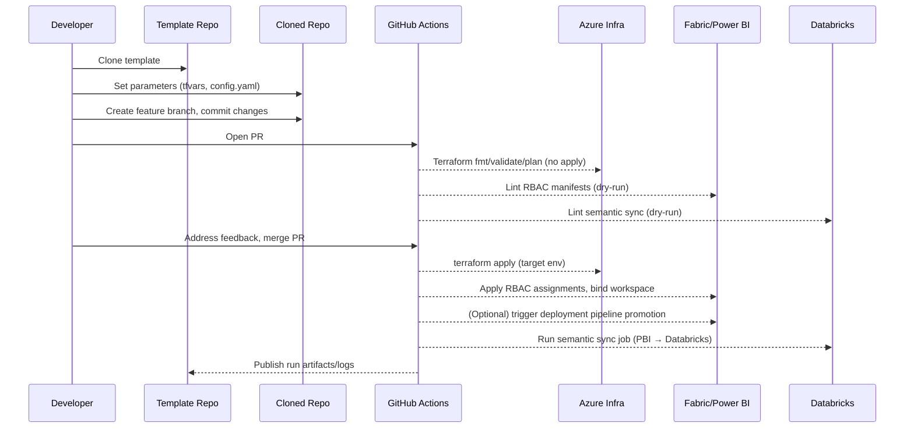

# Data Platform IaC & GitOps Solution Architecture

## Scope and goals
- Provide a repeatable template repository that provisions and governs a Microsoft data platform (Azure + Fabric + Power BI + Databricks) via Terraform and GitHub Actions.
- Enable GitOps flows: clone template → set a few parameters → CI validates → CD deploys infra/RBAC → manage Fabric/Power BI assets and semantic sync to Databricks.
- Favor idempotent, environment-aware automation (dev/test/prod) with least-privilege identity and auditable changes.

## Assumptions
- Azure landing zone and tenant already exist; platform team can create subscriptions, resource groups, managed identities, and service principals with Graph/Power BI/Fabric permissions.
- GitHub Actions uses OIDC to authenticate to Azure; no long-lived secrets. Power BI/Fabric API access is granted to the same app (Service Principal) with Workspace Admin and Capacity Admin as needed.
- Fabric Git integration is enabled; deployment pipelines may be used per environment (optional).
- Databricks workspace is available (or provisioned by Terraform) with cluster policies and PAT/Service Principal auth.
- Networking: resources can be deployed with private endpoints where applicable; outbound to GitHub is allowed.

## High-level architecture
```mermaid
flowchart LR
    Devs[Developers] -->|PRs| GitHub[GitHub Repos]
    GitHub -->|CI: lint/validate/test| GH_Actions[GitHub Actions]
    GH_Actions -->|OIDC| Azure[Azure Subscription]
    GH_Actions -->|REST/Graph| Fabric[Microsoft Fabric]
    GH_Actions -->|REST/XMLA| PowerBI[Power BI]
    GH_Actions -->|REST/Workspace API| Databricks[Azure Databricks]
    Azure -->|Terraform apply| Infra[Data Platform Resources]
    Infra -->|Data| Lake[ADLS Gen2]
    Infra --> KeyVault[Key Vault]
    Infra --> LogAnalytics[Log Analytics]
    Infra --> VNet[VNet/Private Endpoints]
    Infra --> SQL[Azure SQL / Synapse / EventHub (as needed)]
    Fabric --> FabricWS[Fabric Workspaces & Items]
    FabricWS --> PBI[Power BI Semantic Models]
    PBI --> SyncJob[Semantic Sync Python Job]
    SyncJob --> DBSQL[Databricks SQL / Lakehouse]
```

## Template repository layout (proposed)
```
root/
  README.md
  docs/
    solution-architecture.md        # this document
    operations.md                   # runbooks, break-glass, DR
  env/
    dev.tfvars / test.tfvars / prod.tfvars
    backend.hcl                     # remote state (e.g., Azure Storage + key vault key)
  terraform/
    main.tf                         # stacks infra modules
    providers.tf                    # azurerm, databricks, random, tls
    versions.tf
    modules/
      core/                         # RG, KV, networking, diagnostics
      data/                         # ADLS, Event Hub/Synapse/SQL as needed
      security/                     # AAD groups, role assignments
      databricks/                   # workspace, clusters, PAT/SP, repos
      monitoring/                   # Log Analytics, alerts
      fabric/                       # (optional) capacity registration metadata
  scripts/
    bootstrap/                      # post-clone param script (e.g., ./init.sh)
    fabric-rbac/
      assign_workspace_roles.ps1    # uses Fabric/Power BI admin REST + Graph
      assign_item_permissions.ps1   # datasets/lakehouses/notebooks roles
      service_principal_setup.ps1   # adds SP as admin, creates groups
    semantic-sync/
      sync_semantic_to_databricks.py# Python scenario (see below)
      config.sample.yaml
  .github/workflows/
    ci.yml                          # fmt/validate/test Terraform, lint scripts
    plan.yml                        # terraform plan on PR with comments
    apply.yml                       # protected environment deploy + RBAC + sync
    semantic-sync.yml               # scheduled/manual semantic sync job
  .github/actions/                  # composite actions (auth, terraform, fabric)
  .devcontainer/                    # optional dev container with az cli, terraform, databricks cli
```

## Terraform strategy
- **State**: Remote backend in Azure Storage with state locks (Blob + key vault key). One state per environment.
- **Providers**: `azurerm` (features enabled), `azuread` for groups, `databricks`, optionally `null/resource` for glue scripts.
- **Module composition**: small, opinionated modules with inputs only; no local provisioning logic in root.
- **Key resources** (adjust to the provided diagram once confirmed):
  - Resource groups per layer (platform vs workload).
  - Networking: VNet, subnets, private endpoints for Storage, Key Vault, Databricks, SQL.
  - Data: ADLS Gen2 (with hierarchical namespace), Event Hub/Kafka or Synapse/SQL DB, Diagnostics to Log Analytics.
  - Security: Key Vault for secrets; RBAC role assignments (Reader/Contributor/Data roles) bound to AAD groups and managed identity for CI/CD.
  - Databricks: workspace, cluster policies, default SQL warehouse, repo configuration (optional connect to GitHub).
  - Fabric: capacity metadata (where supported via API) or documented manual step; workspace URLs stored as outputs.

## Fabric RBAC automation (CLI scripts)
- Use PowerShell (or Python) scripts invoking **Fabric and Power BI REST APIs** plus **Microsoft Graph**:
  - Add service principal as Fabric/Power BI admin (requires tenant admin approval once).
  - Create or reuse AAD groups for each role set (Admin/Member/Contributor/Viewers) and assign to Fabric workspace.
  - Assign item-level permissions: Lakehouse, Warehouse, Notebooks, Semantic Models, Reports.
  - Optionally manage deployment pipelines: add stages, connect workspaces, set rules.
- Scripts organized under `scripts/fabric-rbac/`, parameterized by environment (workspace name, capacity id, group ids) with a single entrypoint wrapper.
- Idempotency: scripts should be re-runnable; compare current vs desired assignments before changes.

## GitHub Actions workflows
- **CI (ci.yml)**: terraform fmt/validate, tflint (optional), unit tests for helper scripts, security scans.
- **Plan (plan.yml)**: on PR, generate Terraform plan per changed environment; comment on PR; requires OIDC to Azure.
- **Apply (apply.yml)**: on merge to main or manual dispatch; protected environments (dev/test/prod) with approvals. Steps: authenticate (OIDC), `terraform apply`, run `fabric-rbac` scripts, run semantic sync (optional), upload artifacts (plans, logs).
- **Semantic Sync (semantic-sync.yml)**: scheduled and on demand; runs `sync_semantic_to_databricks.py` to align PBI semantic model with Databricks objects; posts result to PR/status.
- **Reusable composite actions** in `.github/actions/` for auth and Terraform to DRY workflow definitions.

## Semantic model → Databricks sync (Python scenario)
Proposed approach for `scripts/semantic-sync/sync_semantic_to_databricks.py`:
1. Authenticate to Power BI via service principal (Workspace Admin) using `msal`.
2. Call XMLA endpoint (or `datasets` REST) to export the semantic model definition (TMSL/JSON).
3. Transform measures/relationships into Databricks SQL objects:
   - Persist tables to Unity Catalog/Lakehouse (if not already) using Delta tables.
   - Convert measures to Databricks SQL views or functions; generate DDL and apply via Databricks REST or `databricks-sql-connector`.
   - Store the exported TMSL alongside generated SQL in `artifacts/semantic-sync/<workspace>/<dataset>/` committed back (optional).
4. Apply changes idempotently in Databricks (compare hash/version before executing).
5. Emit run metadata (dataset version, hash, applied objects) for observability.

Configuration: `config.sample.yaml` containing workspace id, dataset id, databricks SQL endpoint/warehouse, catalog/schema mapping, include/exclude lists. The sync workflow reads this config per environment.

## Fabric Git operations & workflows (from "Working with CICD in Microsoft Fabric")
- **Branching model**: feature branches → PR → main; Fabric items are linked to the repo via Fabric Git integration. Developers pull/push notebooks/lakehouses from Fabric to branches; CI validates; main represents source of truth.
- **Sync directions**:
  - **Publish to Fabric**: From main to Fabric workspace using deployment pipelines or Fabric Git integration (manual or automated via CLI/API).
  - **Pull from Fabric**: Developers pull Fabric changes into feature branches; PR merges back to main.
- **Deployment pipeline (optional)**: connect Dev/Test/Prod Fabric workspaces; rules map data connections/parameters per stage; promotion is triggered by GitHub Actions after Terraform apply.
- **Workspace bindings**: each environment workspace is bound to the corresponding branch/folder to avoid cross-env drift.
- **Non-multi-tenant**: single tenant, multiple envs (dev/test/prod) within it; capacity is pre-allocated per env.

## GitOps flow (end-to-end)


## Bootstrap (post-clone)
1. Run `scripts/bootstrap/init.sh` to:
   - Copy `env/dev.tfvars` to a new environment file and set names/locations.
   - Configure backend storage and key vault references.
   - Create GitHub OIDC federated credentials for the repo (or output steps).
   - Create initial config for semantic sync (`config.sample.yaml`).
2. Register the service principal in Power BI/Fabric Admin Portal and grant required permissions (one-time admin action).

## Open questions / confirmations
- Which exact components are in scope per the supplied infrastructure picture (e.g., Synapse vs Fabric Warehouse, Event Hub vs Kafka, Purview, ADF)?
- Should Terraform also create the Fabric capacity or is that pre-provisioned?
- Preferred languages for automation scripts (PowerShell vs Python) for Fabric RBAC?
- How should semantic sync express measures in Databricks (views, SQL functions, dbt models)?
- Do you want deployment pipelines for Fabric or Git integration-only?

## Next steps
- Confirm scope and components, then scaffold the template repo structure and initial Terraform modules.
- Implement CI workflows (fmt/validate/plan) and stub apply with OIDC.
- Add Fabric RBAC scripts and sample configs; validate permissions.
- Implement the semantic sync Python script skeleton and a Databricks SQL mapping example.
