# Data Platform Infrastructure as Code
## GitOps Solution Architecture

**Version:** 2.0  
**Status:** Final  
**Date:** December 2025  
**Target Platforms:** Azure, Databricks, Microsoft Fabric, Power BI

---

## Table of Contents

1. [Executive Summary](#1-executive-summary)
2. [GitOps Principles for Fabric](#2-gitops-principles-for-fabric)
3. [Architecture Overview](#3-architecture-overview)
4. [Repository Structure](#4-repository-structure)
5. [Workspace-to-Branch Mapping Strategy](#5-workspace-to-branch-mapping-strategy)
6. [Terraform Infrastructure](#6-terraform-infrastructure)
7. [Fabric Git Integration & APIs](#7-fabric-git-integration--apis)
8. [Microsoft Fabric RBAC Management](#8-microsoft-fabric-rbac-management)
9. [GitHub Actions CI/CD](#9-github-actions-cicd)
10. [Deployment Scenarios](#10-deployment-scenarios)
11. [Power BI to Databricks Synchronization](#11-power-bi-to-databricks-synchronization)
12. [Row-Level Security Templates](#12-row-level-security-templates)
13. [Multi-Tenant Architecture Considerations](#13-multi-tenant-architecture-considerations)
14. [Unit Testing Framework](#14-unit-testing-framework)
15. [Deployment Guide](#15-deployment-guide)
16. [Appendices](#appendices)

---

## 1. Executive Summary

This document defines the solution architecture for implementing a comprehensive Infrastructure as Code (IaC) approach to managing a modern data platform spanning Azure, Databricks, Microsoft Fabric, and Power BI. The solution employs **GitOps principles**, where Git serves as the **single source of truth** for all deployments, ensuring consistency and traceability throughout the development lifecycle.

### 1.1 Key GitOps Objectives

- **One-click deployment** with no manual steps except approval gates
- **Git as single source of truth** — all deployments originate from the repository
- **Reuse of existing IaC mechanisms** (Terraform, ARM) alongside Fabric-native Git integration
- **Automated deployment pipelines** transitioning code through DEV → UAT → Production rings
- **Workspace-to-branch mapping** enabling contextual development and canary deployments
- **Fabric Git APIs** for automated synchronization and status checks

### 1.2 Scope

| In Scope | Out of Scope |
|----------|--------------|
| Azure Resource Group provisioning | Databricks workspace provisioning (existing) |
| Microsoft Fabric capacity (Pay-as-you-go) | Microsoft Purview provisioning (existing) |
| Fabric workspace configuration & Git integration | GDAI Gold layer storage (existing) |
| Workspace-to-branch mapping strategy | Network/VNet configuration |
| RBAC management via CLI scripts | Data pipeline development |
| Power BI semantic model sync to Databricks | Report/dashboard development |
| Deployment pipelines (DEV/UAT/PROD) | |
| Unit testing framework integration | |

---

## 2. GitOps Principles for Fabric

### 2.1 Core Principles

Git integration in Microsoft Fabric enables developers to integrate their development processes, tools, and best practices directly into the Fabric platform:

| Principle | Description |
|-----------|-------------|
| **Version Control** | Backup and version all work; revert to previous stages as needed |
| **Collaboration** | Work alone or collaborate using Git branches |
| **Artifacts as Code** | Maintain all artifacts for deployment as code |
| **Bidirectional Sync** | Connect/disconnect workspace to Git; commit to/update from Git |
| **Automation** | Leverage Fabric REST APIs for CI/CD pipeline integration |

### 2.2 Two Authoring Models

Fabric supports two complementary authoring workflows:

```mermaid
flowchart TB
    subgraph UI_AUTH["Option A: Authoring via Fabric UI"]
        direction LR
        FAB_UI["👤 Developer in<br/>Fabric Workspace"] --> |"1. Save changes"| WS_SAVE["💾 Workspace"]
        WS_SAVE --> |"2. Commit"| GIT_MAIN["🌿 Git Main Branch"]
        GIT_MAIN --> |"3. Create feature branch"| GIT_FEAT_A["✨ Feature Branch"]
        GIT_FEAT_A --> |"4. Deploy via pipeline"| OTHER_WS["🚀 Other Workspaces"]
    end
    
    subgraph IDE_AUTH["Option B: Authoring via IDE"]
        direction LR
        DEV_IDE["👤 Developer in<br/>VS Code"] --> |"1. Clone & develop"| LOCAL["💻 Local Repo"]
        LOCAL --> |"2. Push"| GIT_FEAT_B["✨ Feature Branch"]
        GIT_FEAT_B --> |"3. PR & merge"| GIT_MAIN_B["🌿 Git Main Branch"]
        GIT_MAIN_B --> |"4. Fabric API sync"| FAB_WS["📦 Fabric Workspace"]
    end
```

#### Option A: Authoring through Fabric Workspace UI
1. Make changes directly in Fabric UI
2. Commit changes to Git main branch (source of truth)
3. Create/update feature branches for testing and validation
4. Use deployment pipelines to propagate to UAT/Production rings

#### Option B: Authoring through IDE (VS Code)
1. Clone Git repository to local development environment
2. Develop Fabric artifacts in IDE with extensions and AI assistance
3. Commit and push to feature branch
4. Merge to main after code review and automated tests
5. Fabric Git APIs sync changes to target workspaces

### 2.3 Supported Fabric Artifacts

| Artifact | Git Support | Description |
|----------|-------------|-------------|
| **Data Pipelines** | ✅ Full | ETL/ELT orchestration workflows |
| **Lakehouse** | ✅ Full | Combined data lake + warehouse storage |
| **Notebooks** | ✅ Full | Python, Spark SQL, Scala interactive code |
| **Paginated Reports** | ✅ Full | Pixel-perfect operational reports |
| **Reports** | ✅ Full | Power BI interactive dashboards |
| **Semantic Models** | ✅ Full | Data models with relationships (excludes push datasets, live connections) |
| **Spark Job Definitions** | ✅ Full | Predefined Spark job configurations |
| **Spark Environment** | ✅ Full | Managed Spark cluster configurations |
| **Warehouses** | ✅ Full | SQL-based analytical warehouses |

---

## 3. Architecture Overview

### 3.1 High-Level Solution Architecture

```mermaid
flowchart TB
    subgraph GIT["GitHub Repository<br/>(Single Source of Truth)"]
        direction TB
        FEAT["✨ feature/* branches"]
        DEV_BR["🔧 dev branch"]
        MAIN_BR["🌿 main branch"]
        PROD_BR["🚀 prod branch"]
        
        FEAT --> |"PR"| DEV_BR
        DEV_BR --> |"PR"| MAIN_BR
        MAIN_BR --> |"Release"| PROD_BR
    end

    subgraph CICD["CI/CD Pipeline<br/>(GitHub Actions)"]
        direction TB
        TF_PLAN["🔍 Terraform Plan"]
        TF_APPLY["🏗️ Terraform Apply"]
        UNIT_TEST["🧪 Unit Tests"]
        FAB_SYNC["🔄 Fabric Git Sync API"]
        DEPLOY_PIPE["📦 Deployment Pipeline"]
    end

    subgraph AZURE["Azure Resource Group"]
        direction TB
        FABRIC_CAP["⚡ Fabric Capacity<br/>(F-SKU Pay-as-you-go)"]
        STATE["💾 Terraform State<br/>(Storage Account)"]
        SP["🔑 Service Principal"]
    end

    subgraph FABRIC_ENV["Fabric Environments<br/>(Ring-based Deployment)"]
        direction LR
        WS_DEV["🔧 DEV<br/>Workspace"]
        WS_UAT["🧪 UAT<br/>Workspace"]
        WS_PROD["🚀 PROD<br/>Workspace"]
        
        WS_DEV --> |"Promote"| WS_UAT
        WS_UAT --> |"Release"| WS_PROD
    end

    subgraph SEMANTIC["Semantic Layer<br/>(Existing Infrastructure)"]
        direction TB
        GDAI["🗄️ GDAI Gold<br/>(Storage)"]
        DBX["🔶 Databricks<br/>SQL Serverless + UC"]
        PURVIEW["🔍 Microsoft Purview"]
    end

    subgraph CONSUMERS["Analytics Consumers"]
        direction TB
        NOTEBOOKS["📓 Notebooks"]
        PBI["📊 Power BI"]
        EXCEL["📈 Excel"]
        GENIE["🤖 AI BI Genie"]
        COPILOT["✨ Copilot"]
    end

    %% Git to CI/CD
    GIT --> CICD
    
    %% CI/CD to Azure
    TF_APPLY --> AZURE
    
    %% Branch to Workspace mapping
    DEV_BR --> |"Fabric API"| WS_DEV
    MAIN_BR --> |"Fabric API"| WS_UAT
    PROD_BR --> |"Fabric API"| WS_PROD
    
    %% Azure to Fabric
    FABRIC_CAP --> FABRIC_ENV
    SP --> FAB_SYNC
    
    %% Semantic Layer connections
    GDAI --> DBX
    DBX --> PURVIEW
    DBX --> |"DirectQuery/<br/>Import"| WS_PROD
    
    %% Consumer connections
    WS_PROD --> NOTEBOOKS
    WS_PROD --> PBI
    WS_PROD --> EXCEL
    WS_PROD --> GENIE
    GENIE --> COPILOT
    
    %% Sync back to Databricks
    PBI --> |"Semantic Model<br/>Writeback"| DBX
```

### 3.2 Solution Components

| Component | Description | User Adoption |
|-----------|-------------|---------------|
| **Semantic Layer** | Databricks SQL Serverless with Unity Catalog metrics, integrated with Microsoft Purview for governance | Foundation |
| **Ad-Hoc Exploration** | Fabric Notebooks and Excel integration for data scientists and analysts | New to users |
| **Interactive Reporting** | Power BI and Excel with imported datasets, Row-Level Security support | Widely used |
| **Conversational Analytics** | AI BI Genie and Microsoft Copilot for natural language queries | New to users |

### 3.3 Data Flow Architecture

```mermaid
flowchart LR
    subgraph SOURCE["Data Sources"]
        GDAI["🗄️ GDAI Gold<br/>Layer"]
    end
    
    subgraph SEMANTIC["Semantic Layer"]
        DBX["🔶 Databricks<br/>SQL Serverless"]
        UC["📚 Unity Catalog<br/>Metrics"]
        PURVIEW["🔍 Purview<br/>Governance"]
    end
    
    subgraph FABRIC["Microsoft Fabric"]
        DS["📦 Semantic<br/>Models"]
        RLS["🔒 Row-Level<br/>Security"]
    end
    
    subgraph CONSUME["Consumption Layer"]
        direction TB
        C1["📓 Notebooks<br/>(Ad-Hoc)"]
        C2["📊 Power BI<br/>(Reporting)"]
        C3["📈 Excel<br/>(Analysis)"]
        C4["🤖 AI BI Genie<br/>(Conversational)"]
    end
    
    GDAI --> DBX
    DBX --> UC
    UC --> PURVIEW
    UC --> |"DirectQuery/<br/>Import"| DS
    DS --> RLS
    RLS --> C1
    RLS --> C2
    RLS --> C3
    RLS --> C4
    
    C2 --> |"Scheduled<br/>Writeback"| UC
```

---

## 4. Repository Structure

### 4.1 Git Directory Layout

The repository structure reflects Fabric's artifact organization and supports both IaC and Fabric-native Git integration:

```
data-platform-iac/
├── .github/
│   └── workflows/
│       ├── terraform-plan.yml           # PR validation for infrastructure
│       ├── terraform-apply.yml          # Infrastructure deployment
│       ├── fabric-git-sync.yml          # Fabric workspace sync via API
│       ├── fabric-deployment-pipeline.yml # Cross-workspace deployment
│       ├── powerbi-sync.yml             # Semantic model sync to Databricks
│       └── unit-tests.yml               # Data Factory testing framework
│
├── terraform/
│   ├── modules/
│   │   ├── resource-group/              # Azure RG module
│   │   ├── fabric-capacity/             # Fabric F-SKU provisioning
│   │   ├── purview-integration/         # Purview data source registration
│   │   ├── databricks-connection/       # Databricks connectivity
│   │   ├── storage/                     # Terraform state storage
│   │   └── service-principal/           # CI/CD authentication
│   ├── environments/
│   │   ├── dev/
│   │   │   └── terraform.tfvars
│   │   ├── uat/
│   │   │   └── terraform.tfvars
│   │   └── prod/
│   │       └── terraform.tfvars
│   ├── main.tf
│   ├── variables.tf
│   ├── outputs.tf
│   ├── providers.tf
│   └── backend.tf
│
├── fabric/
│   ├── workspaces/                      # ← Fabric Git-synced artifacts
│   │   ├── .platform                    # Workspace metadata
│   │   ├── DataPipelines/
│   │   │   └── {pipeline-name}.DataPipeline/
│   │   │       ├── pipeline-content.json
│   │   │       └── item.metadata.json
│   │   ├── Lakehouses/
│   │   │   └── {lakehouse-name}.Lakehouse/
│   │   ├── Notebooks/
│   │   │   └── {notebook-name}.Notebook/
│   │   │       ├── notebook-content.py
│   │   │       └── item.metadata.json
│   │   ├── SemanticModels/
│   │   │   └── {model-name}.SemanticModel/
│   │   │       ├── definition.pbism
│   │   │       ├── model.bim
│   │   │       └── item.metadata.json
│   │   ├── Reports/
│   │   │   └── {report-name}.Report/
│   │   ├── SparkJobDefinitions/
│   │   │   └── {job-name}.SparkJobDefinition/
│   │   └── Warehouses/
│   │       └── {warehouse-name}.Warehouse/
│   │
│   ├── rbac/
│   │   ├── config/
│   │   │   ├── groups.yaml              # Azure AD group references
│   │   │   └── role-mappings.yaml       # Workspace role assignments
│   │   └── scripts/
│   │       ├── apply-rbac.ps1
│   │       └── validate-rbac.ps1
│   │
│   ├── deployment-pipelines/
│   │   ├── workspace-mapping.yaml       # Branch ↔ Workspace mapping
│   │   └── deployment-rules.yaml        # Cross-environment rules
│   │
│   └── git-integration/
│       └── sync-config.yaml             # Git sync configuration
│
├── powerbi/
│   ├── rls/
│   │   ├── templates/
│   │   │   ├── region-based.json
│   │   │   ├── department-based.json
│   │   │   └── hierarchy-based.json
│   │   ├── role-definitions/
│   │   │   └── roles.yaml
│   │   └── apply-rls.ps1
│   └── sync/
│       ├── extract-semantic-model.py
│       ├── transform-to-uc.py
│       └── sync-to-databricks.py
│
├── scripts/
│   ├── setup.sh                         # Initial setup script
│   ├── validate.sh                      # Pre-deployment validation
│   ├── bootstrap-state.sh               # Terraform state bootstrap
│   └── fabric-api/
│       ├── connect-workspace.ps1        # Connect workspace to Git
│       ├── sync-workspace.ps1           # Sync workspace ↔ Git
│       └── get-status.ps1               # Get sync status
│
├── tests/
│   ├── unit/
│   │   ├── test_pipelines.py            # Pipeline expression tests
│   │   └── test_activities.py           # Activity execution tests
│   └── integration/
│       └── test_end_to_end.py
│
├── diagrams/                            # Architecture diagrams (Mermaid)
├── docs/                                # Additional documentation
├── config.yaml                          # Main configuration file
├── config.yaml.template                 # Configuration template
└── README.md
```

### 4.2 Fabric Git Artifact Structure

Each Fabric artifact follows a consistent structure in Git:

```
{artifact-name}.{ArtifactType}/
├── item.metadata.json          # Artifact metadata (name, type, ID)
├── item.config.json            # Configuration settings (optional)
├── .platform                   # Platform-specific settings
└── {content-files}             # Type-specific content
```

**Example: Notebook**
```
ETL-Daily-Load.Notebook/
├── item.metadata.json
├── notebook-content.py
└── .platform
```

**Example: Data Pipeline**
```
Ingest-Customer-Data.DataPipeline/
├── item.metadata.json
├── pipeline-content.json
└── .platform
```

**Example: Semantic Model**
```
Sales-Analytics.SemanticModel/
├── item.metadata.json
├── definition.pbism
├── model.bim
└── .platform
```

---

## 5. Workspace-to-Branch Mapping Strategy

### 5.1 Branch-to-Workspace Architecture

Each Fabric workspace connects to a single Git branch at a time. This enables environment isolation and controlled promotions through deployment rings:

```mermaid
flowchart TB
    subgraph BRANCHES["Git Branches"]
        direction TB
        FEAT["✨ feature/*<br/>(ephemeral)"]
        DEV["🔧 dev<br/>(integration)"]
        MAIN["🌿 main<br/>(release candidate)"]
        PROD["🚀 prod<br/>(production)"]
    end

    subgraph WORKSPACES["Fabric Workspaces"]
        direction TB
        WS_FEAT["🔧 Feature Workspace<br/>(auto-created, auto-deleted)"]
        WS_DEV["🔧 DEV Workspace<br/>(continuous integration)"]
        WS_UAT["🧪 UAT Workspace<br/>(user acceptance testing)"]
        WS_PROD["🚀 PROD Workspace<br/>(production)"]
    end

    subgraph FLOW["Promotion Flow"]
        direction LR
        F1["1️⃣ Develop"] --> F2["2️⃣ Integrate"]
        F2 --> F3["3️⃣ Validate"]
        F3 --> F4["4️⃣ Release"]
    end

    FEAT --> |"1:1"| WS_FEAT
    DEV --> |"1:1"| WS_DEV
    MAIN --> |"1:1"| WS_UAT
    PROD --> |"1:1"| WS_PROD

    FEAT --> |"PR"| DEV
    DEV --> |"PR + Approval"| MAIN
    MAIN --> |"Release + Approval"| PROD

    WS_FEAT -.-> F1
    WS_DEV -.-> F2
    WS_UAT -.-> F3
    WS_PROD -.-> F4
```

### 5.2 Workspace Mapping Configuration

```yaml
# fabric/deployment-pipelines/workspace-mapping.yaml
environments:
  development:
    workspace_name: "DataPlatform-DEV"
    workspace_id: "xxxxxxxx-xxxx-xxxx-xxxx-xxxxxxxxxxxx"
    git_branch: "dev"
    capacity: "fabric-dev-capacity"
    auto_sync: true
    sync_direction: "PreferRemote"
    
  uat:
    workspace_name: "DataPlatform-UAT"
    workspace_id: "yyyyyyyy-yyyy-yyyy-yyyy-yyyyyyyyyyyy"
    git_branch: "main"
    capacity: "fabric-uat-capacity"
    auto_sync: true
    sync_direction: "PreferRemote"
    requires_approval: true
    approvers:
      - "SG-Fabric-LeadDevelopers"
    
  production:
    workspace_name: "DataPlatform-PROD"
    workspace_id: "zzzzzzzz-zzzz-zzzz-zzzz-zzzzzzzzzzzz"
    git_branch: "prod"
    capacity: "fabric-prod-capacity"
    auto_sync: false          # Manual deployment only
    sync_direction: "PreferRemote"
    requires_approval: true
    approvers:
      - "SG-Fabric-Admins"
      - "SG-Release-Managers"

feature_workspaces:
  enabled: true
  naming_pattern: "DataPlatform-Feature-{branch_name}"
  capacity: "fabric-dev-capacity"
  auto_create: true
  auto_delete_after_merge: true
  cleanup_delay_days: 7
```

### 5.3 Contextual Branch Switching

The Fabric UI "Branches" tab provides centralized branch management:

| Feature | Description |
|---------|-------------|
| **Branch Overview** | View all active branches with commit histories and status |
| **Workspace Synchronization** | Link current workspace to any Git branch |
| **Branch Switching** | Transition workspace to different branch with one click |
| **Conflict Resolution** | View, compare, and resolve merge conflicts |
| **Branch Creation** | Create new feature branches directly from Fabric |
| **Branch Deletion** | Delete obsolete branches after merge |
| **Branch Insights** | Analytics on commits, contributors, last update time |

### 5.4 Conflict Resolution Strategies

```mermaid
flowchart TB
    CONFLICT["🔴 Conflict Detected"]
    
    CONFLICT --> OPT1["Option 1:<br/>Undo + Update"]
    CONFLICT --> OPT2["Option 2:<br/>Resolve in Fabric UI"]
    CONFLICT --> OPT3["Option 3:<br/>Resolve in GitHub"]
    
    OPT1 --> |"Revert local changes"| UPDATE1["Update from Git"]
    OPT2 --> |"Select preferred content"| MERGE2["Merge in UI"]
    OPT3 --> |"Checkout branch"| RESOLVE3["Resolve in IDE"]
    
    UPDATE1 --> RESOLVED["✅ Conflict Resolved"]
    MERGE2 --> RESOLVED
    RESOLVE3 --> |"Push & sync"| RESOLVED
```
### 5.5 Capacity Planning for Ring Deployments

When assigning workspaces to pipeline stages:
- **DEV workspace** → F2 or F4 SKU (development/iteration)
- **UAT workspace** → F4 or F8 SKU (testing with production-like data)
- **PROD workspace** → F8+ SKU (depends on concurrent users and query complexity)

Separate capacities avoid resource contention during testing and ensure production SLAs.

---

## 6. Terraform Infrastructure

### 6.1 Module Organization

| Module | Purpose | Key Resources |
|--------|---------|---------------|
| `resource-group` | Azure resource containment | `azurerm_resource_group` |
| `fabric-capacity` | Fabric F-SKU (per environment) | `azurerm_fabric_capacity` |
| `purview-integration` | Register data sources in existing Purview | `azurerm_purview_account` (data) |
| `databricks-connection` | Connect to existing Databricks workspace | `databricks_sql_endpoint` (data) |
| `storage` | Terraform state backend with locking | `azurerm_storage_account`, `azurerm_storage_container` |
| `service-principal` | CI/CD authentication | `azuread_application`, `azuread_service_principal` |

### 6.2 Provider Configuration

```hcl
# terraform/providers.tf
terraform {
  required_version = ">= 1.5.0"
  
  required_providers {
    azurerm = {
      source  = "hashicorp/azurerm"
      version = "~> 3.85"
    }
    azuread = {
      source  = "hashicorp/azuread"
      version = "~> 2.47"
    }
    databricks = {
      source  = "databricks/databricks"
      version = "~> 1.35"
    }
  }
}

provider "azurerm" {
  features {}
  subscription_id = var.azure_subscription_id
  tenant_id       = var.azure_tenant_id
}

provider "azuread" {
  tenant_id = var.azure_tenant_id
}

provider "databricks" {
  host = var.databricks_workspace_url
}
```

### 6.3 State Management

```hcl
# terraform/backend.tf
terraform {
  backend "azurerm" {
    resource_group_name  = "rg-tfstate"
    storage_account_name = "stterraformstate"
    container_name       = "tfstate"
    key                  = "dataplatform.tfstate"
    use_azuread_auth     = true
  }
}
```

### 6.4 Fabric Capacity Module

```hcl
# terraform/modules/fabric-capacity/main.tf
resource "azurerm_fabric_capacity" "main" {
  name                = "${var.project_name}-${var.environment}"
  resource_group_name = var.resource_group_name
  location            = var.location
  
  sku {
    name = var.sku_name  # F2 (dev), F4 (uat), F8+ (prod)
    tier = "Fabric"
  }
  
  administration_members = var.admin_members
  
  tags = merge(var.tags, {
    Environment = var.environment
    ManagedBy   = "Terraform"
    GitOps      = "true"
  })
}

# terraform/modules/fabric-capacity/variables.tf
variable "project_name" {
  type        = string
  description = "Project name prefix"
}

variable "environment" {
  type        = string
  description = "Environment name (dev, uat, prod)"
}

variable "sku_name" {
  type        = string
  description = "Fabric SKU (F2, F4, F8, F16, F32, F64)"
  default     = "F2"
}

variable "admin_members" {
  type        = list(string)
  description = "List of admin email addresses"
}
```

### 6.5 Environment-Specific Configuration

```hcl
# terraform/environments/prod/terraform.tfvars
project_name    = "dataplatform"
environment     = "prod"
location        = "westeurope"

# Fabric capacity
fabric_sku      = "F8"
admin_members   = [
  "admin@contoso.com",
  "platform-team@contoso.com"
]

# Existing resources (data sources)
databricks_workspace_url = "https://adb-1234567890.azuredatabricks.net"
purview_account_name     = "purview-enterprise"
purview_resource_group   = "rg-governance"

# Tags
tags = {
  Environment  = "Production"
  CostCenter   = "IT-Analytics"
  Owner        = "DataPlatformTeam"
  Compliance   = "SOC2"
}
```

---

## 7. Fabric Git Integration & APIs

### 7.1 Fabric REST API Categories

Fabric exposes public APIs for GitOps automation:

```mermaid
flowchart LR
    subgraph APIS["Fabric Git REST APIs"]
        direction TB
        CONN["🔌 Connection APIs"]
        SYNC["🔄 Sync APIs"]
        STATUS["📊 Status APIs"]
    end
    
    subgraph CONN_OPS["Connection Operations"]
        C1["Connect workspace to Git"]
        C2["Disconnect workspace"]
        C3["Get connection info"]
        C4["Initialize connection"]
    end
    
    subgraph SYNC_OPS["Sync Operations"]
        S1["Commit to Git"]
        S2["Update from Git"]
        S3["Get changes"]
    end
    
    subgraph STATUS_OPS["Status Operations"]
        ST1["Get Git status"]
        ST2["Get item status"]
        ST3["Get sync state"]
    end
    
    CONN --> CONN_OPS
    SYNC --> SYNC_OPS
    STATUS --> STATUS_OPS
```

| API Category | Endpoint | Method | Purpose |
|--------------|----------|--------|---------|
| **Connection** | `/workspaces/{id}/git/connect` | POST | Connect workspace to Git branch |
| **Connection** | `/workspaces/{id}/git/disconnect` | POST | Disconnect workspace from Git |
| **Connection** | `/workspaces/{id}/git/getConnection` | GET | Get current connection details |
| **Connection** | `/workspaces/{id}/git/initializeConnection` | POST | Initialize sync direction |
| **Sync** | `/workspaces/{id}/git/commitToGit` | POST | Push workspace changes to Git |
| **Sync** | `/workspaces/{id}/git/updateFromGit` | POST | Pull Git changes to workspace |
| **Status** | `/workspaces/{id}/git/status` | GET | Get overall sync status |

### 7.2 Connect Workspace to Git Branch

```powershell
# scripts/fabric-api/connect-workspace.ps1
param(
    [Parameter(Mandatory=$true)][string]$WorkspaceName,
    [Parameter(Mandatory=$true)][string]$OrganizationName,
    [Parameter(Mandatory=$true)][string]$ProjectName,
    [Parameter(Mandatory=$true)][string]$RepositoryName,
    [Parameter(Mandatory=$true)][string]$BranchName,
    [Parameter(Mandatory=$true)][string]$DirectoryName
)

# Authenticate
$token = (Get-AzAccessToken -ResourceUrl "https://api.fabric.microsoft.com").Token
$headers = @{
    "Authorization" = "Bearer $token"
    "Content-Type"  = "application/json"
}

# Get workspace ID by name
$workspaces = Invoke-RestMethod -Uri "https://api.fabric.microsoft.com/v1/workspaces" -Headers $headers
$workspace = $workspaces.value | Where-Object { $_.displayName -eq $WorkspaceName }

if (-not $workspace) {
    throw "Workspace '$WorkspaceName' not found"
}

$workspaceId = $workspace.id
Write-Host "Found workspace: $WorkspaceName (ID: $workspaceId)"

# Connect to Git
$connectBody = @{
    gitProviderDetails = @{
        organizationName = $OrganizationName
        projectName      = $ProjectName
        repositoryName   = $RepositoryName
        branchName       = $BranchName
        directoryName    = $DirectoryName
    }
} | ConvertTo-Json -Depth 5

Write-Host "Connecting workspace to branch '$BranchName'..."
Invoke-RestMethod `
    -Uri "https://api.fabric.microsoft.com/v1/workspaces/$workspaceId/git/connect" `
    -Headers $headers `
    -Method Post `
    -Body $connectBody

# Initialize connection (prefer Git as source of truth)
$initBody = @{
    initializationStrategy = "PreferRemote"
} | ConvertTo-Json

Write-Host "Initializing connection (PreferRemote)..."
Invoke-RestMethod `
    -Uri "https://api.fabric.microsoft.com/v1/workspaces/$workspaceId/git/initializeConnection" `
    -Headers $headers `
    -Method Post `
    -Body $initBody

Write-Host "✅ Workspace '$WorkspaceName' connected to branch '$BranchName'"
```

### 7.3 Sync Workspace from Git

```powershell
# scripts/fabric-api/sync-workspace.ps1
param(
    [Parameter(Mandatory=$true)][string]$WorkspaceId,
    [ValidateSet("UpdateFromGit","CommitToGit")]
    [string]$Direction = "UpdateFromGit",
    [string]$CommitMessage = "Automated commit from CI/CD pipeline"
)

$token = (Get-AzAccessToken -ResourceUrl "https://api.fabric.microsoft.com").Token
$headers = @{
    "Authorization" = "Bearer $token"
    "Content-Type"  = "application/json"
}

# Get current status
$status = Invoke-RestMethod `
    -Uri "https://api.fabric.microsoft.com/v1/workspaces/$WorkspaceId/git/status" `
    -Headers $headers

Write-Host "Current Status:"
Write-Host "  Workspace Head: $($status.workspaceHead)"
Write-Host "  Remote Commit:  $($status.remoteCommitHash)"

if ($Direction -eq "UpdateFromGit") {
    if ($status.remoteCommitHash -eq $status.workspaceHead) {
        Write-Host "ℹ️ Workspace is already up to date"
        return
    }
    
    $body = @{
        remoteCommitHash = $status.remoteCommitHash
        conflictResolution = @{
            conflictResolutionPolicy = "PreferRemote"
        }
        options = @{
            allowOverwriteArtifact = $true
        }
    } | ConvertTo-Json -Depth 3
    
    Write-Host "Updating workspace from Git..."
    $result = Invoke-RestMethod `
        -Uri "https://api.fabric.microsoft.com/v1/workspaces/$WorkspaceId/git/updateFromGit" `
        -Headers $headers `
        -Method Post `
        -Body $body
    
    Write-Host "✅ Workspace updated from Git"
}
elseif ($Direction -eq "CommitToGit") {
    $body = @{
        mode = "All"
        comment = $CommitMessage
    } | ConvertTo-Json
    
    Write-Host "Committing workspace changes to Git..."
    $result = Invoke-RestMethod `
        -Uri "https://api.fabric.microsoft.com/v1/workspaces/$WorkspaceId/git/commitToGit" `
        -Headers $headers `
        -Method Post `
        -Body $body
    
    Write-Host "✅ Changes committed to Git"
}
```

### 7.4 Get Sync Status

```powershell
# scripts/fabric-api/get-status.ps1
param(
    [Parameter(Mandatory=$true)][string]$WorkspaceId,
    [switch]$IncludeItems
)

$token = (Get-AzAccessToken -ResourceUrl "https://api.fabric.microsoft.com").Token
$headers = @{ "Authorization" = "Bearer $token" }

# Get overall status
$status = Invoke-RestMethod `
    -Uri "https://api.fabric.microsoft.com/v1/workspaces/$WorkspaceId/git/status" `
    -Headers $headers

Write-Host "=== Git Sync Status ===" -ForegroundColor Cyan
Write-Host "Workspace Head:  $($status.workspaceHead)"
Write-Host "Remote Commit:   $($status.remoteCommitHash)"
Write-Host "Sync Required:   $($status.workspaceHead -ne $status.remoteCommitHash)"

if ($IncludeItems) {
    Write-Host "`n=== Item Status ===" -ForegroundColor Cyan
    
    # Get item-level status
    $itemStatus = Invoke-RestMethod `
        -Uri "https://api.fabric.microsoft.com/v1/workspaces/$WorkspaceId/git/status" `
        -Headers $headers
    
    if ($itemStatus.changes) {
        $itemStatus.changes | ForEach-Object {
            $icon = switch ($_.conflictType) {
                "None" { "✅" }
                "Conflict" { "⚠️" }
                default { "❓" }
            }
            Write-Host "$icon $($_.itemType): $($_.displayName) - $($_.workspaceChange)"
        }
    } else {
        Write-Host "No pending changes"
    }
}

# Return status object for pipeline use
return @{
    SyncRequired = ($status.workspaceHead -ne $status.remoteCommitHash)
    WorkspaceHead = $status.workspaceHead
    RemoteCommit = $status.remoteCommitHash
}
```

---

## 8. Microsoft Fabric RBAC Management

### 8.1 Role Assignment Model

```mermaid
flowchart TB
    subgraph AAD["Azure Active Directory"]
        direction TB
        G_ADMIN["🔐 SG-Fabric-Admins"]
        G_DEV["👨‍💻 SG-Fabric-Developers"]
        G_CONTRIB["✏️ SG-Fabric-Contributors"]
        G_VIEW["👁️ SG-Fabric-Viewers"]
        G_RLS["🔒 SG-PowerBI-RLS-*"]
    end

    subgraph CONFIG["Git Repository"]
        GROUPS["groups.yaml"]
        ROLES["role-mappings.yaml"]
    end

    subgraph SCRIPTS["Automation"]
        VALIDATE["validate-rbac.ps1"]
        APPLY["apply-rbac.ps1"]
    end

    subgraph FABRIC["Fabric Workspaces"]
        subgraph WS_DEV["DEV Workspace"]
            R_DEV_A["Admin"]
            R_DEV_M["Member"]
            R_DEV_C["Contributor"]
        end
        subgraph WS_UAT["UAT Workspace"]
            R_UAT_A["Admin"]
            R_UAT_V["Viewer"]
        end
        subgraph WS_PROD["PROD Workspace"]
            R_PROD_A["Admin"]
            R_PROD_V["Viewer"]
        end
    end

    GROUPS --> VALIDATE
    ROLES --> VALIDATE
    VALIDATE --> APPLY
    
    G_ADMIN --> R_DEV_A
    G_ADMIN --> R_UAT_A
    G_ADMIN --> R_PROD_A
    
    G_DEV --> R_DEV_M
    G_DEV --> R_UAT_V
    
    G_CONTRIB --> R_DEV_C
    
    G_VIEW --> R_PROD_V
```

### 8.2 Role Capabilities

| Role | Capabilities |
|------|--------------|
| **Admin** | Full control: workspace settings, member management, delete workspace |
| **Member** | Create, edit, delete content; share items; manage item permissions |
| **Contributor** | Create, edit, delete content within workspace |
| **Viewer** | View and interact with content; cannot edit, delete, or share |

### 8.3 RBAC Configuration Files

```yaml
# fabric/rbac/config/groups.yaml
groups:
  # Reference existing Azure AD security groups
  existing:
    - name: "SG-Fabric-Admins"
      object_id: "aaaaaaaa-aaaa-aaaa-aaaa-aaaaaaaaaaaa"
      description: "Platform administrators"
    
    - name: "SG-Fabric-Developers"
      object_id: "bbbbbbbb-bbbb-bbbb-bbbb-bbbbbbbbbbbb"
      description: "Development team members"
    
    - name: "SG-Fabric-Contributors"
      object_id: "cccccccc-cccc-cccc-cccc-cccccccccccc"
      description: "Data engineers and analysts"
    
    - name: "SG-Fabric-Viewers"
      object_id: "dddddddd-dddd-dddd-dddd-dddddddddddd"
      description: "Report consumers"
  
  # RLS-specific groups
  rls:
    - name: "SG-PowerBI-RegionalUsers"
      object_id: "eeeeeeee-eeee-eeee-eeee-eeeeeeeeeeee"
    
    - name: "SG-PowerBI-DepartmentUsers"
      object_id: "ffffffff-ffff-ffff-ffff-ffffffffffff"
```

```yaml
# fabric/rbac/config/role-mappings.yaml
workspaces:
  - name: "DataPlatform-DEV"
    environment: "dev"
    roles:
      admin:
        groups: ["SG-Fabric-Admins"]
      member:
        groups: ["SG-Fabric-Developers"]
      contributor:
        groups: ["SG-Fabric-Contributors"]
      viewer:
        groups: []

  - name: "DataPlatform-UAT"
    environment: "uat"
    roles:
      admin:
        groups: ["SG-Fabric-Admins"]
      member:
        groups: []
      contributor:
        groups: []
      viewer:
        groups: ["SG-Fabric-Developers", "SG-Fabric-Contributors"]

  - name: "DataPlatform-PROD"
    environment: "prod"
    roles:
      admin:
        groups: ["SG-Fabric-Admins"]
      member:
        groups: []
      contributor:
        groups: []
      viewer:
        groups: ["SG-Fabric-Viewers"]
```

---

## 9. GitHub Actions CI/CD

### 9.1 Workflow Overview


### 9.2 Required GitHub Secrets

| Secret | Description |
|--------|-------------|
| `AZURE_CLIENT_ID` | Service principal application ID |
| `AZURE_CLIENT_SECRET` | Service principal secret |
| `AZURE_TENANT_ID` | Azure AD tenant ID |
| `AZURE_SUBSCRIPTION_ID` | Target Azure subscription |
| `DATABRICKS_HOST` | Databricks workspace URL |
| `DATABRICKS_TOKEN` | Databricks PAT or service principal token |

### 9.3 Required GitHub Variables

| Variable | Description |
|----------|-------------|
| `DEV_WORKSPACE_ID` | Fabric DEV workspace GUID |
| `UAT_WORKSPACE_ID` | Fabric UAT workspace GUID |
| `PROD_WORKSPACE_ID` | Fabric PROD workspace GUID |
| `DEPLOYMENT_PIPELINE_ID` | Fabric deployment pipeline GUID |

### 9.4 Terraform Plan Workflow

```yaml
# .github/workflows/terraform-plan.yml
name: Terraform Plan

on:
  pull_request:
    branches: [main]
    paths:
      - 'terraform/**'
      - 'config.yaml'

env:
  TF_VERSION: '1.6.0'
  WORKING_DIR: './terraform'

jobs:
  plan:
    name: Terraform Plan
    runs-on: ubuntu-latest
    
    steps:
      - name: Checkout
        uses: actions/checkout@v4

      - name: Setup Terraform
        uses: hashicorp/setup-terraform@v3
        with:
          terraform_version: ${{ env.TF_VERSION }}

      - name: Azure Login
        uses: azure/login@v1
        with:
          creds: |
            {
              "clientId": "${{ secrets.AZURE_CLIENT_ID }}",
              "clientSecret": "${{ secrets.AZURE_CLIENT_SECRET }}",
              "subscriptionId": "${{ secrets.AZURE_SUBSCRIPTION_ID }}",
              "tenantId": "${{ secrets.AZURE_TENANT_ID }}"
            }

      - name: Terraform Init
        working-directory: ${{ env.WORKING_DIR }}
        run: terraform init

      - name: Terraform Plan
        id: plan
        working-directory: ${{ env.WORKING_DIR }}
        run: terraform plan -no-color -out=tfplan
        continue-on-error: true

      - name: Post Plan to PR
        uses: actions/github-script@v7
        with:
          script: |
            const output = `#### Terraform Plan 📖
            
            \`\`\`
            ${{ steps.plan.outputs.stdout }}
            \`\`\`
            
            *Pushed by: @${{ github.actor }}*`;
            
            github.rest.issues.createComment({
              issue_number: context.issue.number,
              owner: context.repo.owner,
              repo: context.repo.repo,
              body: output
            })

      - name: Plan Status
        if: steps.plan.outcome == 'failure'
        run: exit 1
```

### 9.5 Fabric Git Sync Workflow

```yaml
# .github/workflows/fabric-git-sync.yml
name: Fabric Git Sync

on:
  push:
    branches: [dev, main, prod]
    paths:
      - 'fabric/workspaces/**'
  workflow_dispatch:
    inputs:
      environment:
        description: 'Target environment'
        required: true
        type: choice
        options: [dev, uat, prod]

jobs:
  determine-environment:
    runs-on: ubuntu-latest
    outputs:
      environment: ${{ steps.set-env.outputs.environment }}
      workspace_id: ${{ steps.set-env.outputs.workspace_id }}
    steps:
      - name: Determine environment from branch
        id: set-env
        run: |
          if [[ "${{ github.event_name }}" == "workflow_dispatch" ]]; then
            ENV="${{ inputs.environment }}"
          elif [[ "${{ github.ref }}" == "refs/heads/dev" ]]; then
            ENV="dev"
          elif [[ "${{ github.ref }}" == "refs/heads/main" ]]; then
            ENV="uat"
          elif [[ "${{ github.ref }}" == "refs/heads/prod" ]]; then
            ENV="prod"
          fi
          
          echo "environment=$ENV" >> $GITHUB_OUTPUT
          
          case $ENV in
            dev)  echo "workspace_id=${{ vars.DEV_WORKSPACE_ID }}" >> $GITHUB_OUTPUT ;;
            uat)  echo "workspace_id=${{ vars.UAT_WORKSPACE_ID }}" >> $GITHUB_OUTPUT ;;
            prod) echo "workspace_id=${{ vars.PROD_WORKSPACE_ID }}" >> $GITHUB_OUTPUT ;;
          esac

  sync-workspace:
    needs: determine-environment
    runs-on: ubuntu-latest
    environment: ${{ needs.determine-environment.outputs.environment }}
    
    steps:
      - name: Checkout
        uses: actions/checkout@v4

      - name: Azure Login
        uses: azure/login@v1
        with:
          creds: |
            {
              "clientId": "${{ secrets.AZURE_CLIENT_ID }}",
              "clientSecret": "${{ secrets.AZURE_CLIENT_SECRET }}",
              "subscriptionId": "${{ secrets.AZURE_SUBSCRIPTION_ID }}",
              "tenantId": "${{ secrets.AZURE_TENANT_ID }}"
            }

      - name: Sync Workspace from Git
        shell: pwsh
        env:
          WORKSPACE_ID: ${{ needs.determine-environment.outputs.workspace_id }}
        run: |
          $token = (Get-AzAccessToken -ResourceUrl "https://api.fabric.microsoft.com").Token
          $headers = @{
            "Authorization" = "Bearer $token"
            "Content-Type"  = "application/json"
          }
          
          # Get current status
          $status = Invoke-RestMethod `
            -Uri "https://api.fabric.microsoft.com/v1/workspaces/$env:WORKSPACE_ID/git/status" `
            -Headers $headers
          
          Write-Host "Workspace head: $($status.workspaceHead)"
          Write-Host "Remote commit:  $($status.remoteCommitHash)"
          
          if ($status.remoteCommitHash -ne $status.workspaceHead) {
            $body = @{
              remoteCommitHash = $status.remoteCommitHash
              conflictResolution = @{
                conflictResolutionPolicy = "PreferRemote"
              }
              options = @{
                allowOverwriteArtifact = $true
              }
            } | ConvertTo-Json -Depth 3
            
            Invoke-RestMethod `
              -Uri "https://api.fabric.microsoft.com/v1/workspaces/$env:WORKSPACE_ID/git/updateFromGit" `
              -Headers $headers -Method Post -Body $body
            
            Write-Host "✅ Workspace synced successfully"
          } else {
            Write-Host "ℹ️ Workspace already up to date"
          }
```

### 9.6 Unit Tests Workflow

```yaml
# .github/workflows/unit-tests.yml
name: Unit Tests

on:
  pull_request:
    branches: [dev, main]
    paths:
      - 'fabric/workspaces/DataPipelines/**'
      - 'tests/**'

jobs:
  test:
    name: Run Unit Tests
    runs-on: ubuntu-latest
    
    steps:
      - name: Checkout
        uses: actions/checkout@v4

      - name: Setup Python
        uses: actions/setup-python@v5
        with:
          python-version: '3.11'

      - name: Install dependencies
        run: |
          pip install data-factory-testing-framework pytest pytest-cov

      - name: Run unit tests
        run: |
          pytest tests/unit/ -v --junitxml=test-results.xml --cov=fabric/workspaces

      - name: Publish test results
        uses: dorny/test-reporter@v1
        if: always()
        with:
          name: Unit Test Results
          path: test-results.xml
          reporter: java-junit
```

---

## 10. Deployment Scenarios

### 10.1 Scenario 1: GitOps-Based Deployments from Branches

Git serves as the single source of truth with dedicated branches for each deployment stage:

```mermaid
flowchart LR
    subgraph GIT["Git Repository"]
        DEV_BR["🔧 dev branch"]
        MAIN_BR["🌿 main branch"]
        PROD_BR["🚀 prod branch"]
    end

    subgraph API["Fabric Git APIs"]
        SYNC["🔄 UpdateFromGit"]
    end

    subgraph FABRIC["Fabric Workspaces"]
        WS_DEV["DEV"]
        WS_UAT["UAT"]
        WS_PROD["PROD"]
    end

    DEV_BR --> |"PR"| MAIN_BR
    MAIN_BR --> |"Release"| PROD_BR

    DEV_BR --> |"API Sync"| SYNC
    MAIN_BR --> |"API Sync"| SYNC
    PROD_BR --> |"API Sync"| SYNC

    SYNC --> WS_DEV
    SYNC --> WS_UAT
    SYNC --> WS_PROD
```

**Key Steps:**
1. Map each environment to a dedicated Git branch
2. Use Fabric Git APIs to sync changes between repository and workspace
3. Apply automated deployment pipelines to transition code through rings
4. Maintain approval gates for UAT and Production promotions

### 10.2 Scenario 2: Feature Branch Development

```mermaid
sequenceDiagram
    autonumber
    participant DEV as 👨‍💻 Developer
    participant FEAT as ✨ Feature Branch
    participant DEV_BR as 🔧 Dev Branch
    participant DEV_WS as 🔧 DEV Workspace
    participant MAIN as 🌿 Main Branch
    participant UAT_WS as 🧪 UAT Workspace
    participant PROD_BR as 🚀 Prod Branch
    participant PROD_WS as 🚀 PROD Workspace

    DEV->>FEAT: 1. Create feature branch
    DEV->>FEAT: 2. Develop & commit changes
    
    Note over FEAT: Unit tests run automatically
    
    FEAT->>DEV_BR: 3. Create PR
    DEV_BR->>DEV_BR: 4. Code review & approval
    DEV_BR->>DEV_WS: 5. Auto-sync via Fabric API
    
    Note over DEV_WS: Integration testing
    
    DEV_BR->>MAIN: 6. PR to main
    MAIN->>MAIN: 7. Approval gate
    MAIN->>UAT_WS: 8. Auto-sync via Fabric API
    
    Note over UAT_WS: User acceptance testing
    
    MAIN->>PROD_BR: 9. Release merge
    PROD_BR->>PROD_BR: 10. Release approval
    PROD_BR->>PROD_WS: 11. Manual sync trigger
    
    Note over PROD_WS: Production deployment
```

### 10.3 Scenario 3: Git + Fabric Deployment Pipelines

Combine Git integration with Fabric's native deployment pipelines for rule-based deployments:

```mermaid
flowchart TB
    subgraph GIT["Git Repository"]
        MAIN["main branch"]
    end

    subgraph DEV_STAGE["Development Stage"]
        DEV_WS["DEV Workspace"]
    end

    subgraph FABRIC_PIPELINE["Fabric Deployment Pipeline"]
        direction LR
        RULES["Deployment Rules:<br/>• Connection strings<br/>• Parameters<br/>• Lakehouse bindings"]
    end

    subgraph UAT_STAGE["UAT Stage"]
        UAT_WS["UAT Workspace"]
    end

    subgraph PROD_STAGE["Production Stage"]
        PROD_WS["PROD Workspace"]
    end

    MAIN --> |"Git Sync"| DEV_WS
    DEV_WS --> |"Deploy with rules"| FABRIC_PIPELINE
    FABRIC_PIPELINE --> UAT_WS
    UAT_WS --> |"Deploy with rules"| FABRIC_PIPELINE
    FABRIC_PIPELINE --> PROD_WS
```

### 10.4 Scenario 4: Spark Job Management from Git


---

## 11. Power BI to Databricks Synchronization

### 11.1 Sync Architecture

```mermaid
flowchart LR
    subgraph PBI["Power BI Service"]
        SEM["📊 Semantic Model"]
        XMLA["🔌 XMLA Endpoint"]
        MEASURES["Measures"]
        DIMS["Dimensions"]
        RELS["Relationships"]
    end

    subgraph SYNC["Scheduled Sync Process"]
        EXTRACT["1️⃣ Extract<br/>pyadomd"]
        TRANSFORM["2️⃣ Transform<br/>Python"]
        LOAD["3️⃣ Load<br/>databricks-sdk"]
    end

    subgraph DBX["Databricks Unity Catalog"]
        UC["🗃️ Unity Catalog"]
        METRICS["📏 UC Metrics Layer"]
        CATALOG["Catalog: semantic_models"]
        SCHEMA["Schema: powerbi_sync"]
    end

    SEM --> XMLA
    XMLA --> EXTRACT
    MEASURES --> EXTRACT
    DIMS --> EXTRACT
    RELS --> EXTRACT

    EXTRACT --> TRANSFORM
    TRANSFORM --> LOAD

    LOAD --> UC
    UC --> METRICS
    METRICS --> CATALOG
    CATALOG --> SCHEMA
```

### 11.2 Sync Approaches (from Fabric semantic-sync)

| Approach | Method | Pros | Cons |
|----------|--------|------|------|
| **A: Semantic Link (Fabric)** | Fabric notebook with `semantic-link` to list datasets/tables/measures/relationships; write to UC via Spark | Native, simple, no external infra; works inside Fabric | Preview; limited admin metadata (e.g., refresh history, lineage) |
| **B: Power BI REST + Admin Scanner** | Service principal with Power BI Admin APIs to scan workspaces (expressions, schema, datasource, lineage, refresh history) and land to UC | Most complete governance view; captures refresh history/lineage | Requires Admin scope; Premium/Fabric capacity for large scans; polling needed |
| **C: XMLA Endpoint (DMV/TMSL)** | `pyadomd`/TOM via XMLA to export full model (DMVs) | Full semantic fidelity (measures, relationships, roles, partitions) | Requires Premium/Fabric capacity; gateway if private |
| **D: Fabric REST TMDL** | `POST /workspaces/{id}/semanticModels/{id}/getDefinition` (format `tmdl`) | Structured model definition; aligns with Fabric APIs | Coverage still evolving; transform to UC schema needed |

### 11.3 Recommended Implementation (Approach D: Fabric REST TMDL)

Extracts the complete TMDL (Tabular Model Definition Language) representation via Fabric REST API—aligned with Fabric's native APIs and future-proof for governance.

```python
# powerbi/sync/extract-semantic-model-fabric-rest.py
import os
import requests
import json
from datetime import datetime

FABRIC_API = "https://api.fabric.microsoft.com/v1"
TENANT_ID = os.environ.get("AZURE_TENANT_ID")
CLIENT_ID = os.environ.get("AZURE_CLIENT_ID")
CLIENT_SECRET = os.environ.get("AZURE_CLIENT_SECRET")

def get_fabric_token():
    """Acquire Azure AD token for Fabric API"""
    url = f"https://login.microsoftonline.com/{TENANT_ID}/oauth2/v2.0/token"
    payload = {
        "grant_type": "client_credentials",
        "client_id": CLIENT_ID,
        "client_secret": CLIENT_SECRET,
        "scope": "https://api.fabric.microsoft.com/.default"
    }
    response = requests.post(url, data=payload)
    return response.json()["access_token"]

def extract_semantic_model(workspace_id: str, semantic_model_id: str) -> dict:
    """Extract semantic model definition via Fabric REST API (TMDL format)."""
    
    token = get_fabric_token()
    headers = {
        "Authorization": f"Bearer {token}",
        "Content-Type": "application/json"
    }
    
    # Get semantic model definition in TMDL format
    url = (
        f"{FABRIC_API}/workspaces/{workspace_id}/"
        f"semanticModels/{semantic_model_id}/getDefinition"
    )
    
    payload = {"format": "tmdl"}
    
    response = requests.post(url, headers=headers, json=payload)
    
    if response.status_code != 200:
        raise Exception(f"Failed to extract model: {response.status_code} {response.text}")
    
    definition = response.json()
    
    return {
        "semantic_model_id": semantic_model_id,
        "workspace_id": workspace_id,
        "definition": definition,
        "extraction_timestamp": datetime.utcnow().isoformat()
    }

def parse_tmdl_definition(definition: dict) -> dict:
    """Parse TMDL definition into structured metadata."""
    
    parsed = {
        "measures": [],
        "tables": [],
        "relationships": [],
        "roles": []
    }
    
    # Extract tables and their measures
    for table in definition.get("tables", []):
        table_record = {
            "name": table.get("name"),
            "displayName": table.get("displayName"),
            "isHidden": table.get("isHidden", False),
            "source": table.get("source")
        }
        parsed["tables"].append(table_record)
        
        # Extract measures from table
        for measure in table.get("measures", []):
            measure_record = {
                "table": table.get("name"),
                "name": measure.get("name"),
                "displayName": measure.get("displayName"),
                "expression": measure.get("expression"),
                "dataType": measure.get("dataType"),
                "formatString": measure.get("formatString"),
                "isHidden": measure.get("isHidden", False),
                "description": measure.get("description")
            }
            parsed["measures"].append(measure_record)
    
    # Extract relationships
    for relationship in definition.get("relationships", []):
        rel_record = {
            "name": relationship.get("name"),
            "fromTable": relationship.get("fromTable"),
            "fromColumn": relationship.get("fromColumn"),
            "toTable": relationship.get("toTable"),
            "toColumn": relationship.get("toColumn"),
            "type": relationship.get("type"),
            "crossFilteringBehavior": relationship.get("crossFilteringBehavior")
        }
        parsed["relationships"].append(rel_record)
    
    # Extract roles (RLS)
    for role in definition.get("roles", []):
        role_record = {
            "name": role.get("name"),
            "modelPermission": role.get("modelPermission"),
            "tablePermissions": role.get("tablePermissions", [])
        }
        parsed["roles"].append(role_record)
    
    return parsed
```

```python
# powerbi/sync/sync-to-databricks.py
import os
import json
from databricks.sdk import WorkspaceClient
from datetime import datetime

def sync_to_uc(model_metadata: dict, catalog: str, schema: str):
    """Write semantic model definitions to Unity Catalog."""
    
    client = WorkspaceClient(
        host=os.environ["DATABRICKS_HOST"],
        token=os.environ["DATABRICKS_TOKEN"]
    )
    
    semantic_model_id = model_metadata["semantic_model_id"]
    parsed_definition = model_metadata["parsed_definition"]
    extraction_timestamp = model_metadata["extraction_timestamp"]
    
    # Write semantic model metadata
    model_record = {
        "semantic_model_id": semantic_model_id,
        "definition_json": json.dumps(model_metadata["definition"]),
        "extraction_timestamp": extraction_timestamp,
        "extraction_method": "Fabric REST TMDL"
    }
    
    from pyspark.sql import SparkSession
    spark = SparkSession.builder.build()
    
    # Write model definition
    spark.createDataFrame([model_record]).write \
        .mode("append") \
        .option("mergeSchema", "true") \
        .saveAsTable(f"{catalog}.{schema}.semantic_model_definitions")
    
    # Write tables
    for table in parsed_definition["tables"]:
        table["semantic_model_id"] = semantic_model_id
        table["extraction_timestamp"] = extraction_timestamp
    
    spark.createDataFrame(parsed_definition["tables"]).write \
        .mode("append") \
        .option("mergeSchema", "true") \
        .saveAsTable(f"{catalog}.{schema}.semantic_model_tables")
    
    # Write measures
    for measure in parsed_definition["measures"]:
        measure["semantic_model_id"] = semantic_model_id
        measure["extraction_timestamp"] = extraction_timestamp
    
    spark.createDataFrame(parsed_definition["measures"]).write \
        .mode("append") \
        .option("mergeSchema", "true") \
        .saveAsTable(f"{catalog}.{schema}.semantic_model_measures")
    
    # Write relationships
    for relationship in parsed_definition["relationships"]:
        relationship["semantic_model_id"] = semantic_model_id
        relationship["extraction_timestamp"] = extraction_timestamp
    
    spark.createDataFrame(parsed_definition["relationships"]).write \
        .mode("append") \
        .option("mergeSchema", "true") \
        .saveAsTable(f"{catalog}.{schema}.semantic_model_relationships")
    
    # Write roles (for RLS governance)
    for role in parsed_definition["roles"]:
        role["semantic_model_id"] = semantic_model_id
        role["extraction_timestamp"] = extraction_timestamp
    
    spark.createDataFrame(parsed_definition["roles"]).write \
        .mode("append") \
        .option("mergeSchema", "true") \
        .saveAsTable(f"{catalog}.{schema}.semantic_model_roles")
    
    print(f"✅ Semantic model {semantic_model_id} synchronized to {catalog}.{schema}")
```

### 11.3.1 Why Fabric REST TMDL (Approach D)?

- **Future-proof:** Aligns with Fabric's native API strategy
- **Structured format:** TMDL is version-controlled and parseable
- **Complete coverage:** Captures tables, measures, relationships, roles, and metadata
- **No external dependencies:** Works directly with Fabric API (no Premium capacity requirement)
- **Governance-ready:** Roles and RLS definitions included for security auditing

### 11.3.2 Integration with GitHub Actions

```yaml
# .github/workflows/powerbi-sync.yml
name: Semantic Model Sync to Databricks

on:
  schedule:
    - cron: '0 2 * * *'  # Daily at 2 AM UTC
  workflow_dispatch:

jobs:
  sync:
    runs-on: ubuntu-latest
    steps:
      - uses: actions/checkout@v4
      
      - name: Set up Python
        uses: actions/setup-python@v4
        with:
          python-version: '3.11'
      
      - name: Install dependencies
        run: |
          pip install requests databricks-sdk pyspark
      
      - name: Extract and sync semantic models
        env:
          AZURE_TENANT_ID: ${{ secrets.AZURE_TENANT_ID }}
          AZURE_CLIENT_ID: ${{ secrets.AZURE_CLIENT_ID }}
          AZURE_CLIENT_SECRET: ${{ secrets.AZURE_CLIENT_SECRET }}
          DATABRICKS_HOST: ${{ secrets.DATABRICKS_HOST }}
          DATABRICKS_TOKEN: ${{ secrets.DATABRICKS_TOKEN }}
          FABRIC_WORKSPACE_ID: ${{ secrets.FABRIC_WORKSPACE_ID }}
          FABRIC_SEMANTIC_MODEL_ID: ${{ secrets.FABRIC_SEMANTIC_MODEL_ID }}
        run: |
          python powerbi/sync/extract-semantic-model-fabric-rest.py
```
import requests
import json

FABRIC_API = "https://api.fabric.microsoft.com/v1"
WORKSPACE_ID = "<workspace-guid>"
SEMANTIC_MODEL_ID = "<semantic-model-guid>"

def get_fabric_token():
    """Get token scoped for Fabric API"""
    url = f"https://login.microsoftonline.com/{TENANT_ID}/oauth2/v2.0/token"
    payload = {
        "grant_type": "client_credentials",
        "client_id": CLIENT_ID,
        "client_secret": CLIENT_SECRET,
        "scope": "https://api.fabric.microsoft.com/.default"
    }
    return requests.post(url, data=payload).json()["access_token"]

token = get_fabric_token()
headers = {"Authorization": f"Bearer {token}"}

# Get semantic model definition (TMDL format)
url = f"{FABRIC_API}/workspaces/{WORKSPACE_ID}/semanticModels/{SEMANTIC_MODEL_ID}/getDefinition"

response = requests.post(url, headers=headers, json={"format": "tmdl"})
definition = response.json()

# Parse and store model definition
model_definition = {
    "semantic_model_id": SEMANTIC_MODEL_ID,
    "workspace_id": WORKSPACE_ID,
    "definition_json": json.dumps(definition),
    "extraction_timestamp": datetime.utcnow().isoformat()
}

spark.createDataFrame([model_definition]).write \
    .mode("append") \
    .saveAsTable("governance.powerbi_metadata.model_definitions")
```

---

11.4 Unity Catalog Schema Design

I would recommend this schema structure in Databricks, sir:

```sql
-- Create catalog and schema
CREATE CATALOG IF NOT EXISTS governance;
CREATE SCHEMA IF NOT EXISTS governance.powerbi_metadata;

-- Core metadata tables
CREATE TABLE governance.powerbi_metadata.semantic_models (
    model_id STRING,
    model_name STRING,
    workspace_id STRING,
    workspace_name STRING,
    configured_by STRING,
    is_refreshable BOOLEAN,
    is_effective_identity_required BOOLEAN,
    created_date TIMESTAMP,
    extraction_timestamp TIMESTAMP
) USING DELTA;

CREATE TABLE governance.powerbi_metadata.measures (
    model_id STRING,
    model_name STRING,
    table_name STRING,
    measure_name STRING,
    expression STRING,
    data_type STRING,
    format_string STRING,
    is_hidden BOOLEAN,
    extraction_timestamp TIMESTAMP
) USING DELTA;

CREATE TABLE governance.powerbi_metadata.refresh_history (
    model_id STRING,
    refresh_id STRING,
    refresh_type STRING,
    start_time TIMESTAMP,
    end_time TIMESTAMP,
    status STRING,
    request_id STRING,
    extraction_timestamp TIMESTAMP
) USING DELTA;

-- Enable Change Data Feed for tracking
ALTER TABLE governance.powerbi_metadata.measures 
SET TBLPROPERTIES (delta.enableChangeDataFeed = true);
```

---

## 11.5 Orchestration Recommendation

**Azure Data Factory / Fabric Pipeline:**
```json
{
    "name": "PBI_to_UC_Sync_Pipeline",
    "properties": {
        "activities": [
            {
                "name": "Extract_PBI_Metadata",
                "type": "DatabricksNotebook",
                "typeProperties": {
                    "notebookPath": "/Shared/powerbi_metadata_extraction",
                    "baseParameters": {
                        "target_catalog": "governance",
                        "target_schema": "powerbi_metadata"
                    }
                }
            }
        ],
        "triggers": [
            {
                "type": "ScheduleTrigger",
                "recurrence": {
                    "frequency": "Day",
                    "interval": 1,
                    "startTime": "2024-01-01T02:00:00Z"
                }
            }
        ]
    }
}
```

---

## 12. Row-Level Security Templates

### 12.1 RLS Template Structure

```
powerbi/rls/
├── templates/
│   ├── region-based.json
│   ├── department-based.json
│   └── hierarchy-based.json
├── role-definitions/
│   └── roles.yaml
└── apply-rls.ps1
```

### 12.2 Template Examples

**Region-Based RLS:**
```json
{
  "name": "RegionFilter",
  "description": "Filter data by user's assigned region",
  "tableFilters": [
    {
      "table": "DimGeography",
      "expression": "[RegionEmail] = USERPRINCIPALNAME()"
    }
  ],
  "members": ["SG-PowerBI-RegionalUsers"]
}
```

**Manager Hierarchy RLS:**
```json
{
  "name": "ManagerHierarchy",
  "description": "Show only direct reports data",
  "tableFilters": [
    {
      "table": "DimEmployee",
      "expression": "PATHCONTAINS(PATH([EmployeeID], [ManagerID]), LOOKUPVALUE(DimEmployee[EmployeeID], DimEmployee[Email], USERPRINCIPALNAME()))"
    }
  ],
  "members": ["SG-PowerBI-Managers"]
}
```

### 12.3 Role Definitions

```yaml
# powerbi/rls/role-definitions/roles.yaml
datasets:
  - name: "Sales Analytics"
    workspace: "DataPlatform-PROD"
    roles:
      - template: "region-based"
        groups: ["SG-PowerBI-RegionalUsers"]
      
      - template: "department-based"
        groups: ["SG-PowerBI-DepartmentUsers"]

  - name: "HR Analytics"
    workspace: "DataPlatform-PROD"
    roles:
      - template: "hierarchy-based"
        groups: ["SG-PowerBI-Managers"]
```

---

## 13. Multi-Tenant Architecture Considerations

### 13.1 Workspace-per-Tenant Model

For ISV or multi-tenant scenarios, implement workspace isolation:

```mermaid
flowchart TB
    subgraph SHARED["Shared Resources"]
        TEMPLATE["📋 Template Workspace<br/>(Git main branch)"]
        SHARED_DATA["📦 Shared Data Workspace<br/>(Reference data)"]
    end

    subgraph TENANTS["Tenant Workspaces"]
        T1["🏢 Tenant-A Workspace"]
        T2["🏢 Tenant-B Workspace"]
        T3["🏢 Tenant-C Workspace"]
    end

    subgraph ISOLATION["Data Isolation"]
        T1_DATA["Tenant-A Data"]
        T2_DATA["Tenant-B Data"]
        T3_DATA["Tenant-C Data"]
    end

    TEMPLATE --> |"Clone via API"| T1
    TEMPLATE --> |"Clone via API"| T2
    TEMPLATE --> |"Clone via API"| T3
    
    SHARED_DATA --> |"Shortcut"| T1
    SHARED_DATA --> |"Shortcut"| T2
    SHARED_DATA --> |"Shortcut"| T3

    T1 --> T1_DATA
    T2 --> T2_DATA
    T3 --> T3_DATA
```

### 13.2 Multi-Tenant Benefits

| Feature | Benefit |
|---------|---------|
| **Physical Data Isolation** | Each tenant's data in separate workspace/lakehouse |
| **Granular Permissions** | RBAC per workspace ensures tenant isolation |
| **Chargeback Support** | Separate capacities enable per-tenant cost tracking |
| **Canary Deployments** | Individual workspaces can connect to different branches |
| **Shared Data via Shortcuts** | Common reference data without duplication |
| **Regional Compliance** | Capacities can be deployed per region |

### 13.3 Cross-Workspace Queries

For ISV-level reporting across tenants (use with caution):

```yaml
# Cross-workspace query configuration
cross_workspace:
  enabled: true
  method: "SQL Analytics Endpoint + Shortcuts"
  use_cases:
    - "ISV aggregate reporting"
    - "Cross-tenant analytics"
  security:
    - "Dedicated reporting workspace"
    - "Read-only shortcuts"
    - "No tenant PII exposure"
```

---

## 14. Unit Testing Framework

### 14.1 Data Factory Testing Framework

Microsoft provides a standalone test framework for validating Fabric pipelines:


### 14.2 Test Examples

```python
# tests/unit/test_pipelines.py
from data_factory_testing_framework import TestFramework
from data_factory_testing_framework.state import RunState

def test_expression_evaluation():
    """Test pipeline expression evaluation."""
    framework = TestFramework()
    pipeline = framework.load_pipeline(
        "fabric/workspaces/DataPipelines/daily-etl.DataPipeline"
    )
    
    result = framework.evaluate_expression(
        pipeline,
        "@concat('prefix_', pipeline().parameters.tableName)"
    )
    assert result.startswith("prefix_")

def test_activity_output():
    """Test individual activity with mock state."""
    framework = TestFramework()
    pipeline = framework.load_pipeline(
        "fabric/workspaces/DataPipelines/daily-etl.DataPipeline"
    )
    
    activity = pipeline.get_activity("CopyCustomerData")
    state = RunState(parameters={"sourceTable": "customers"})
    
    result = framework.evaluate_activity(activity, state)
    assert result.source.table == "customers"

def test_pipeline_execution_flow():
    """Test complete pipeline execution flow."""
    framework = TestFramework()
    pipeline = framework.load_pipeline(
        "fabric/workspaces/DataPipelines/daily-etl.DataPipeline"
    )
    
    run = framework.run_pipeline(
        pipeline,
        parameters={"environment": "test", "runDate": "2025-01-01"}
    )
    
    assert run.activities_executed == [
        "ValidateInput", "CopyData", "TransformData", "UpdateMetadata"
    ]
    assert run.status == "Succeeded"
```

---

## 15. Deployment Guide

### 15.1 Prerequisites

| Requirement | Details |
|-------------|---------|
| Azure subscription | Owner or Contributor access |
| Databricks workspace | Existing with Unity Catalog enabled |
| Microsoft Purview | Existing instance |
| GDAI Gold storage | Existing storage account |
| GitHub account | Admin access to create repositories |
| Power BI license | Pro or Premium Per User |
| Azure AD permissions | Create service principals and groups |

### 15.2 Initial Setup Steps

```bash
# 1. Clone template repository
git clone https://github.com/your-org/data-platform-iac-template.git my-data-platform
cd my-data-platform

# 2. Configure parameters
cp config.yaml.template config.yaml
# Edit config.yaml with your specific values

# 3. Run initial setup (creates service principal)
chmod +x scripts/setup.sh
./scripts/setup.sh

# 4. Bootstrap Terraform state storage
./scripts/bootstrap-state.sh

# 5. Create GitHub environments
gh api repos/{owner}/{repo}/environments/dev -X PUT
gh api repos/{owner}/{repo}/environments/uat -X PUT
gh api repos/{owner}/{repo}/environments/prod -X PUT

# 6. Configure GitHub secrets
gh secret set AZURE_CLIENT_ID --body "<client-id>"
gh secret set AZURE_CLIENT_SECRET --body "<client-secret>"
gh secret set AZURE_TENANT_ID --body "<tenant-id>"
gh secret set AZURE_SUBSCRIPTION_ID --body "<subscription-id>"
gh secret set DATABRICKS_HOST --body "https://adb-xxx.azuredatabricks.net"
gh secret set DATABRICKS_TOKEN --body "<databricks-token>"

# 7. Configure GitHub variables
gh variable set DEV_WORKSPACE_ID --body "<dev-workspace-guid>"
gh variable set UAT_WORKSPACE_ID --body "<uat-workspace-guid>"
gh variable set PROD_WORKSPACE_ID --body "<prod-workspace-guid>"

# 8. Push to main to trigger deployment
git add .
git commit -m "Initial configuration"
git push origin main
```

### 15.3 Post-Deployment Verification

```bash
# Verify Terraform deployment
cd terraform && terraform plan

# Verify Fabric workspace sync
pwsh scripts/fabric-api/get-status.ps1 -WorkspaceId "<workspace-id>" -IncludeItems

# Run validation script
./scripts/validate.sh
```

---

## Appendices

### A. Fabric Git API Reference

| Endpoint | Method | Purpose |
|----------|--------|---------|
| `/v1/workspaces/{id}/git/connect` | POST | Connect workspace to Git |
| `/v1/workspaces/{id}/git/disconnect` | POST | Disconnect from Git |
| `/v1/workspaces/{id}/git/getConnection` | GET | Get connection details |
| `/v1/workspaces/{id}/git/initializeConnection` | POST | Initialize sync direction |
| `/v1/workspaces/{id}/git/status` | GET | Get sync status |
| `/v1/workspaces/{id}/git/updateFromGit` | POST | Pull from Git |
| `/v1/workspaces/{id}/git/commitToGit` | POST | Push to Git |

### B. Service Principal Permissions

| API | Permission | Type |
|-----|------------|------|
| Microsoft Graph | Directory.Read.All | Application |
| Microsoft Graph | Group.Read.All | Application |
| Power BI Service | Workspace.ReadWrite.All | Application |
| Power BI Service | Dataset.ReadWrite.All | Application |
| Fabric | Capacity.ReadWrite.All | Application |
| Azure Management | Contributor | Role Assignment |

### C. Troubleshooting

| Issue | Solution |
|-------|----------|
| Terraform state lock | `terraform force-unlock <LOCK_ID>` |
| Fabric API 401 | Verify SP has Fabric Admin role |
| Git sync conflict | Use "PreferRemote" or resolve manually |
| XMLA connection failed | Verify Premium capacity is active |
| Pipeline test failure | Check expression syntax in test |

### D. Sample Code Repositories

- **Data Factory Testing Framework:** https://github.com/microsoft/data-factory-testing-framework
- **Fabric DataOps Sample:** https://github.com/Azure-Samples/modern-data-warehouse-dataops/tree/main/single_tech_samples/fabric

### E. Related Documentation

- [Fabric Git Integration](https://learn.microsoft.com/en-us/fabric/cicd/git-integration/intro-to-git-integration)
- [Fabric REST APIs](https://learn.microsoft.com/en-us/rest/api/fabric/)
- [Deployment Pipelines](https://learn.microsoft.com/en-us/fabric/cicd/deployment-pipelines/intro-to-deployment-pipelines)
- [Terraform AzureRM Provider](https://registry.terraform.io/providers/hashicorp/azurerm/latest/docs)
- [Databricks Unity Catalog](https://docs.databricks.com/data-governance/unity-catalog/index.html)

---

*Document Version: 2.0 FINAL | December 2025*  
*Aligned with Microsoft Fabric GitOps Best Practices*